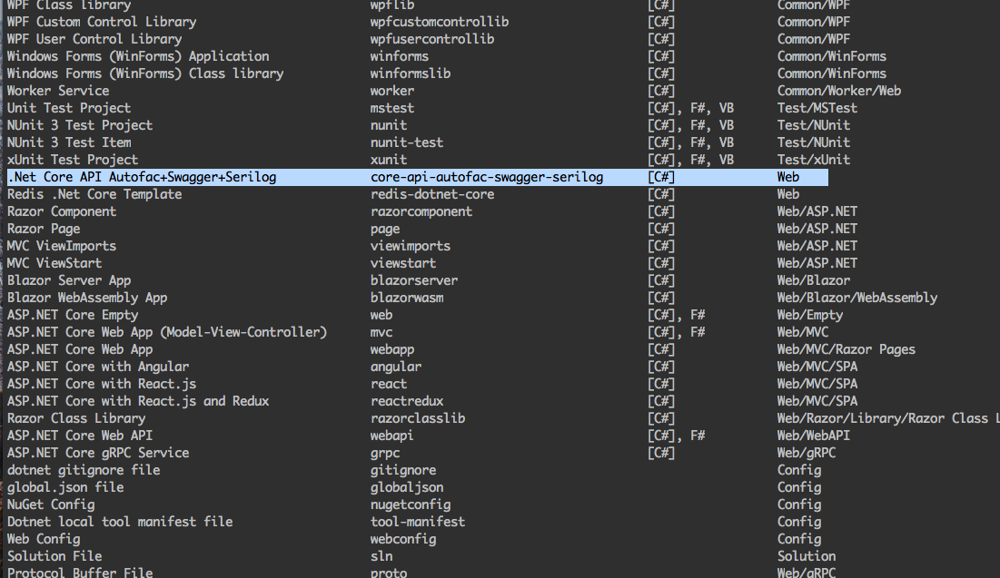
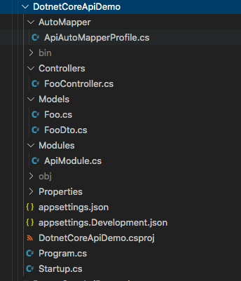

# Project Template - .Net Core 3.1 API + Autofac + Swagger + Serilog + AutoMapper

> This is a project template for .Net Core 3.1 API,
    pre-configured Autofac, Swagger, Serilog, AutoMapper, Newtonsoft.Json
    using `dotnet new -i Superwalnut.NetCoreApiTemplate` to install project as a template,
    And using `dotnet new core-api-autofac-swagger-serilog` to create a project with the template.

**Pre-request**

- .Net Core 3.1
- [Autofac](https://autofac.org/)
- [Swagger](https://swagger.io/)
- [Serilog](https://serilog.net/)
- [AutoMapper](https://automapper.org/)

## Table of Contents

- [Features](#features)
- [Installation](#installation)
- [Usage](#usage)
- [Support](#support)
- [License](#license)

---

## Features

> This is a development project template, it is NOT production ready. It only kickstarting your project so that you don't need to build from scratch.

1. pre-Configured Autofac 5.2.0 registrations setup.
2. Ready Swagger 5.5.1 endpoint. 
3. pre-Configured Serilog 2.9.0 console sinks.
4. pre-Configured AutoMapper 10.0.0.
5. pre-Installed Newtonsoft.Json 12.0.3

6. pre-Setup NUnit Tests
7. pre-Setup AutoFixture with Moq
8. pre-Setup FluentAssertions

---

## Installation

- Using `dotnet new -i <package>` to install the project template from nuget [Superwalnut.NetCoreApiTemplate](https://www.nuget.org/packages/Superwalnut.NetCoreApiTemplate)

```shell
$ dotnet new -i Superwalnut.NetCoreApiTemplate
```

You should see '.Net Core API Autofac+Swagger+Serilog' in your template list by `dotnet new -l`



- Using `dotnet new redis-dotnet-core -n <your-project-name>` to create a project with your own project name using this template

```shell
$ dotnet new core-api-autofac-swagger-serilog -n NetCoreDemo -o NetCoreDemo
```

This creates a project in folder `NetCoreDemo`



---


## Documentation

### Pre-configured Autofac 

ContainerBuilder() that you can populate IServiceCollection and register your autofac modules in Startup.cs. Taking ApiModule from the template as an example, you can also create modules for your Service Layer, Repository Layer, etc.

```c#
        public IServiceProvider ConfigureServices(IServiceCollection services)
        {
            ...
            builder.RegisterModule<ApiModule>();

            var container = builder.Build();
            return container.Resolve<IServiceProvider>();
        }
```

Serilog & Automapper are registered in the ApiModule,

```c#
    public class ApiModule : Module
    {
        protected override void Load(ContainerBuilder builder)
        {
            builder.RegisterLogger();
            builder.AddAutoMapper(x=>x.AddProfile<ApiAutoMapperProfile>());
        }
    }
```

### Pre-configured swagger endpoint

You can access via https://localhost:5001/swagger

```c#
        public IServiceProvider ConfigureServices(IServiceCollection services)
        {
            ...
            if (!Environment.IsProduction())
            {
                services.AddSwaggerGen(
                    c =>
                    {
                        c.SwaggerDoc("v1", new OpenApiInfo { Title = "Api Swagger", Version = "v1" });
                    });
            }
            ...
        }

        public void Configure(IApplicationBuilder app, IWebHostEnvironment env)
        {
            ...
            if (!Environment.IsProduction())
            {
                app.UseSwagger();

                app.UseSwaggerUI(c =>
                {
                    c.SwaggerEndpoint("./v1/swagger.json", "Api V1");
                });
            }
            ...
        }
```

### Pre-configured Serilog 

With console sinks in the appsettings.json

```json
  "Serilog": {
    "Using": [ "Serilog.Sinks.Console" ],
    "MinimumLevel": "Information",
    "WriteTo": [
      {
        "Name": "Console"        
      }
    ]
  }
```

And Serilog configuration in the program.cs

```c#
        public static IWebHostBuilder CreateHostBuilder(string[] args)
        {
            return WebHost.CreateDefaultBuilder(args)
                ...
                .UseSerilog((hostingContext, loggerConfiguration) => loggerConfiguration
                    .MinimumLevel.Override("Microsoft", LogEventLevel.Warning)
                    .MinimumLevel.Override("System", LogEventLevel.Warning)
                    .ReadFrom.Configuration(hostingContext.Configuration)
                    .Enrich.FromLogContext());
        }  
```

And registered in ApiModule,

```c#
    public class ApiModule : Module
    {
        protected override void Load(ContainerBuilder builder)
        {
            builder.RegisterLogger();
            ...
        }
    }
```

### Pre-configured AutoMapper 

With created example profile,

```c#
    public class ApiAutoMapperProfile : Profile
    {
        public ApiAutoMapperProfile()
        {
            CreateMap<Foo, FooDto>();
            ...
        }
    }
```

And register the profile in ApiModule for AutoMapper,

```c#
    public class ApiModule : Module
    {
        protected override void Load(ContainerBuilder builder)
        {
            ...
            builder.AddAutoMapper(x=>x.AddProfile<ApiAutoMapperProfile>());
        }
    }
```

Usage of AutoMapper in Controller, inject into the constructor

```c#
        private readonly IMapper _mapper;

        public FooController(..., IMapper mapper)
        {
            ...
            _mapper = mapper;
        }
```

Consumed in the controller method,

```c#
    var dto = _mapper.Map<List<Foo>, List<FooDto>>(result);
```

### Pre-configured Unit tests

Setup Fixture for your test

```c#
        protected IFixture Fixture { get; private set; }

        [SetUp]
        public void SetupBase()
        {
            Fixture = new Fixture().Customize(new AutoMoqCustomization());
            Fixture.Customize<BindingInfo>(c => c.OmitAutoProperties());
            Fixture.Behaviors.Add(new OmitOnRecursionBehavior());
        }
```

Using Fixture To create mocks

```c#
        [SetUp]
        public void Setup()
        {
            _loggerMock = Fixture.Freeze<Mock<ILogger>>();
            _mapperMock = Fixture.Freeze<Mock<IMapper>>();

            _dtos = new List<FooDto> { new FooDto { Id = new Guid("59a54f7c-f7ea-41dc-89a8-d34aef7c8932"), Name = "test1" } };
            _mapperMock.Setup(x => x.Map<List<Foo>, List<FooDto>>(It.IsAny<List<Foo>>())).Returns(_dtos);
        }
```

And create instances of targeting objects

```c#
        var target = Fixture.Create<FooController>();
```

Validate via FluentAssertions 

```c#
    okObjectResult.Should().NotBeNull();

    okObjectResult.Value.Should().BeOfType<List<FooDto>>();

    okObjectResult.Value.As<List<FooDto>>().Should().BeSameAs(_dtos);
```

## Support

Reach out to me at one of the following places!

- [Follow me @ Github](https://github.com/superwalnut)

- [Twitter](https://twitter.com/superwalnuts)

- [](https://ko-fi.com/Z8Z61I9HB)

---

## License

[](http://badges.mit-license.org)

- **[MIT license](http://opensource.org/licenses/mit-license.php)**

-------